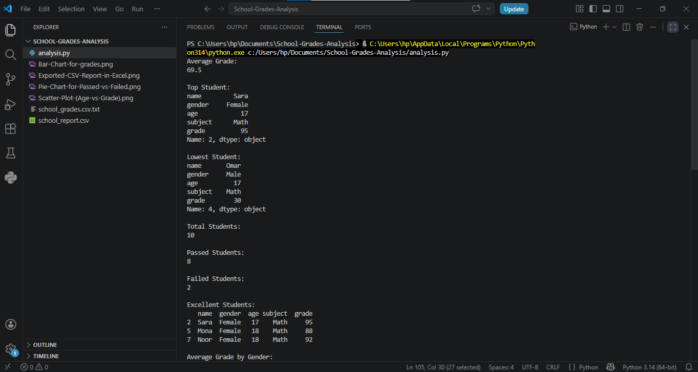
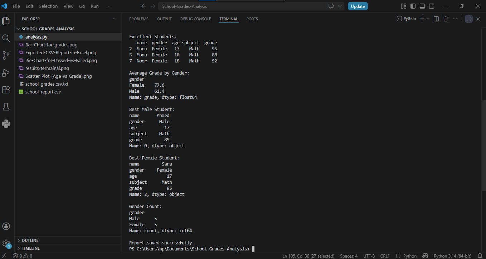
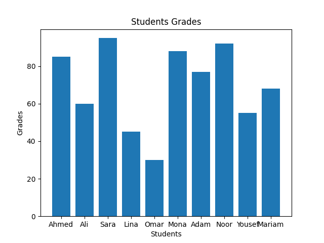
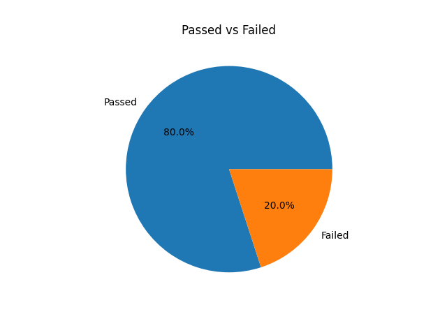
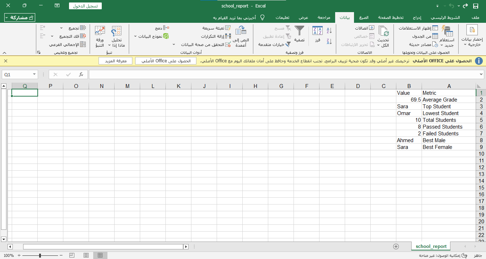

# 📊 School Grades Analysis

A Python project to analyze students' grades using Pandas and Matplotlib, extracting key academic insights.

## 📌 Analysis Objectives

- Calculate *average grade*.
- Identify the *top* and *lowest* student.
- Count *total students*.
- Determine *passed* (>50) and *failed* (<=50) students.
- Extract *excellent students* (>85).
- Analyze performance by *gender* (average, best male, best female).
- Visualize data with:
  - *Bar Chart*: Grades of all students.
  - *Pie Chart*: Passed vs Failed ratio.
  - *Scatter Plot*: Relationship between age and grade.
- Export a *CSV report* with key metrics.

## 🛠️ Technologies Used

- *Python 3.x*
- *Pandas* – Data manipulation.
- *Matplotlib* – Data visualization.

## 📸 Screenshots

### Terminal Output

The following screenshots show the results printed in the terminal after running the script.

### Visualizations

*Bar Chart - Students Grades*

*Pie Chart - Passed vs Failed*

*Scatter Plot - Age vs Grade*
.png)

### Exported CSV Report in Excel

## 🚀 How to Run

1. Install dependencies:
   
   pip install -r requirements.txt

2. Place school_grades.csv in the same directory.
3. Run the script:
   
   python analysis.py
   

📁 Project Structure

School-Grades-Analysis/
├── analysis.py                # Main Python script
├── school_grades.csv          # Input dataset
├── school_report.csv          # Generated report
├── requirements.txt           # Dependencies
└── README.md                  # Documentation